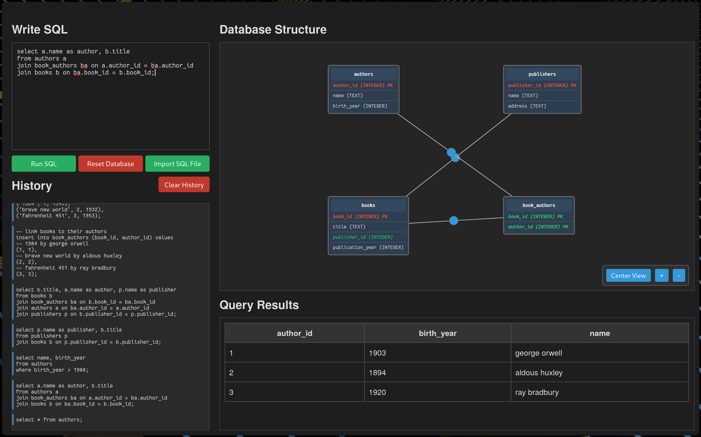

# sqlvisualizenator

To run just do the following:

1. Install `go`
2. Go ge the packages.

```
go get -u github.com/mattn/go-sqlite3
go get -u github.com/gorilla/mux
```

3. Install `sqlite`
4. Run with `go run main.go`.
5: Go to `http://localhost:8080/`

> Did you clone the repo?

# Here is what is used to test it

### 1. **Table Creation**

- **Users Table**

     ```sql
     CREATE TABLE Users (
         user_id INTEGER PRIMARY KEY AUTOINCREMENT,
         username TEXT NOT NULL UNIQUE,
         email TEXT NOT NULL UNIQUE,
         created_at DATETIME DEFAULT CURRENT_TIMESTAMP
     );
     ```

- **Products Table**

     ```sql
     CREATE TABLE Products (
         product_id INTEGER PRIMARY KEY AUTOINCREMENT,
         product_name TEXT NOT NULL,
         description TEXT,
         price NUMERIC NOT NULL CHECK (price >= 0),
         stock INTEGER DEFAULT 0 CHECK (stock >= 0)
     );
     ```

- **Orders Table**

     ```sql
     CREATE TABLE Orders (
         order_id INTEGER PRIMARY KEY AUTOINCREMENT,
         user_id INTEGER NOT NULL,
         order_date DATETIME DEFAULT CURRENT_TIMESTAMP,
         status TEXT DEFAULT 'Pending',
         total NUMERIC DEFAULT 0,
         FOREIGN KEY (user_id) REFERENCES Users(user_id)
     );
     ```

- **OrderItems Table**

     ```sql
     CREATE TABLE OrderItems (
         order_item_id INTEGER PRIMARY KEY AUTOINCREMENT,
         order_id INTEGER NOT NULL,
         product_id INTEGER NOT NULL,
         quantity INTEGER NOT NULL CHECK (quantity > 0),
         price_at_purchase NUMERIC NOT NULL CHECK (price_at_purchase >= 0),
         FOREIGN KEY (order_id) REFERENCES Orders(order_id) ON DELETE CASCADE,
         FOREIGN KEY (product_id) REFERENCES Products(product_id)
     );
     ```

### 2. **Data Insertion**

- **Insert Sample Data into Users**

     ```sql
     INSERT INTO Users (username, email) VALUES
     ('john_doe', 'john@example.com'),
     ('jane_smith', 'jane@example.com'),
     ('alice', 'alice@example.com');
     ```

- **Insert Sample Data into Products**

     ```sql
     INSERT INTO Products (product_name, description, price, stock) VALUES
     ('Laptop', 'High performance laptop', 1200.00, 15),
     ('Smartphone', 'Latest model smartphone', 800.00, 30),
     ('Headphones', 'Noise-cancelling headphones', 150.00, 50),
     ('External Hard Drive', '2TB USB 3.0 external drive', 90.00, 25);
     ```

- **Insert Sample Data into Orders**

     ```sql
     INSERT INTO Orders (user_id, status) VALUES
     (1, 'Completed'),
     (2, 'Pending'),
     (1, 'Processing');
     ```

- **Insert Sample Data into OrderItems**

     ```sql
     INSERT INTO OrderItems (order_id, product_id, quantity, price_at_purchase) VALUES
     (1, 1, 1, 1200.00), -- 1 Laptop
     (1, 3, 2, 150.00),  -- 2 Headphones
     (2, 2, 1, 800.00),  -- 1 Smartphone
     (2, 4, 1, 90.00),   -- 1 External Hard Drive
     (3, 2, 2, 800.00),  -- 2 Smartphones
     (3, 4, 2, 90.00);   -- 2 External Hard Drives
     ```

### 3. **Queries**

- **A. List All Orders**

     ```sql
     SELECT o.order_id,
            u.username,
            o.order_date,
            o.status,
            o.total
     FROM Orders o
     JOIN Users u ON o.user_id = u.user_id
     ORDER BY o.order_date DESC;
     ```

- **B. Detailed Order Information**

     ```sql
     SELECT o.order_id,
            u.username,
            o.order_date,
            p.product_name,
            oi.quantity,
            oi.price_at_purchase,
            (oi.quantity * oi.price_at_purchase) AS line_total
     FROM Orders o
     JOIN Users u ON o.user_id = u.user_id
     JOIN OrderItems oi ON o.order_id = oi.order_id
     JOIN Products p ON oi.product_id = p.product_id
     ORDER BY o.order_id, p.product_name;
     ```
# Proof XD


